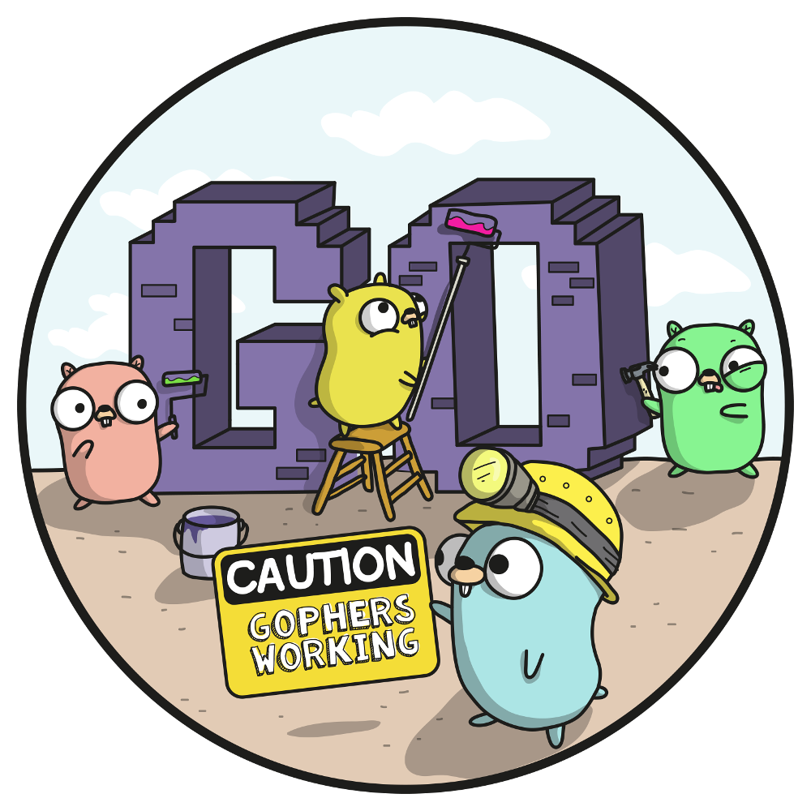

<!-- PROJECT LOGO -->
 

  
  <h1 align="center">Reproducible-Go-Binaries</h1>
  

 A quick and easy way to compile reproducible binaries with Golang.

 
 
 

## How to use this repo

For a full walkthrough on how to use this repo, [check out the Hackernoon article](https://hackernoon.com/building-reproducible-verifiable-binaries-with-golang). Otherwise, read below for a quick overview.

This repo contains a Dockerfile and a Makefile to build reproducible Go binaries across 30 different build combinations. 
  
If you want to build a reproducible binary for a specific operating system/system architecture, first copy the `Dockerfile` into the root directory of your project. Then create a new `Makefile` in the root of your project. Lastly find the OS/system architecture you are looking for in the `Makefile` located in the root of this repo. Copy and paste it into your `Makefile` and you are good to go. Make sure to give your binary file a name by assigning `BUILDARCH` to a value at the top of your `Makefile`. 
  
You can also copy the Makefile in the `all_builds` directory instead to have a lightweight way to easily build reproducible binaries for all 30 build combinations. 
